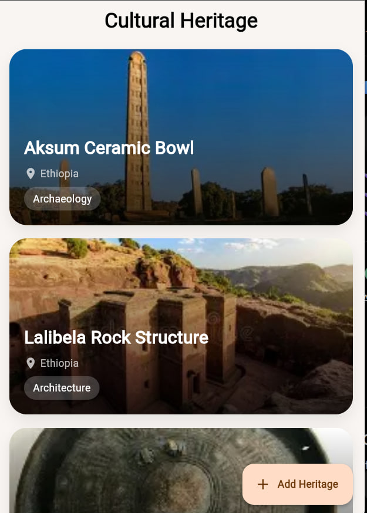
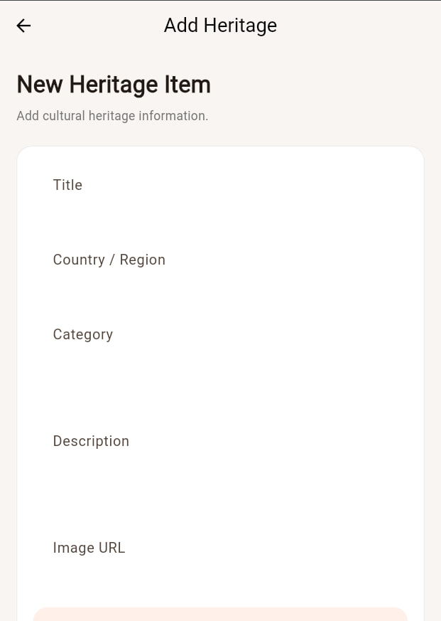
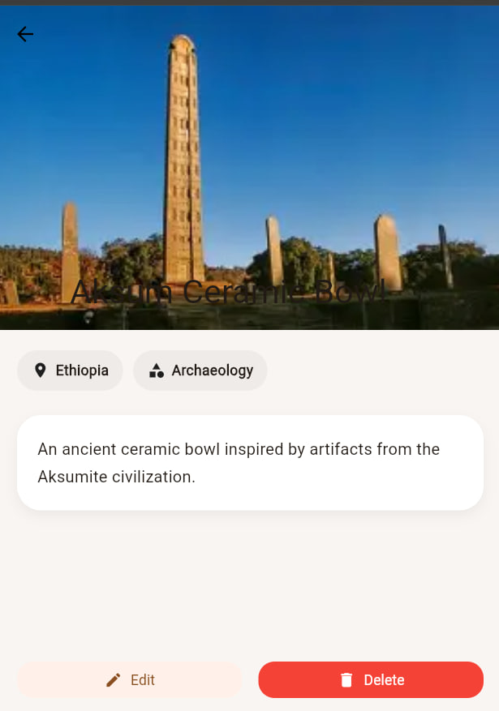
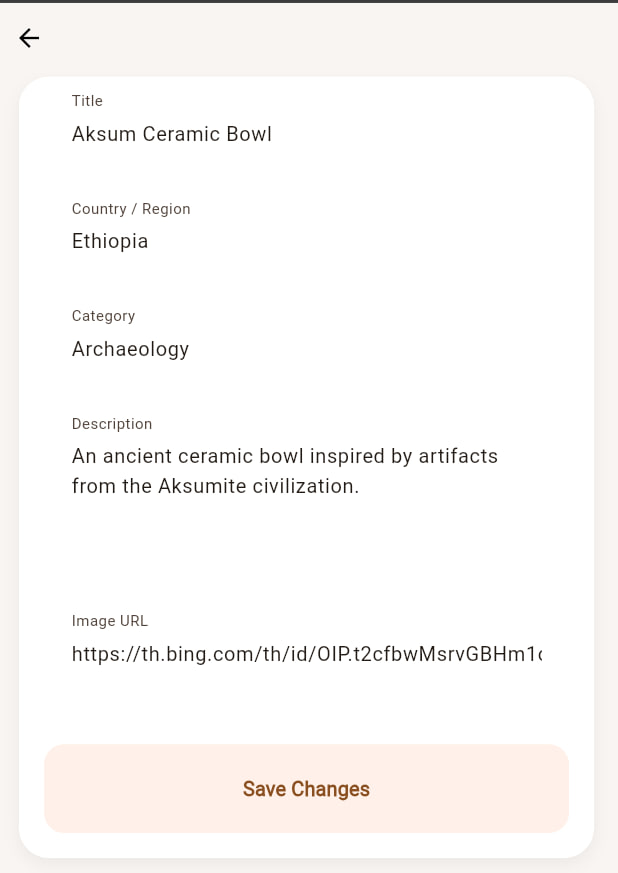
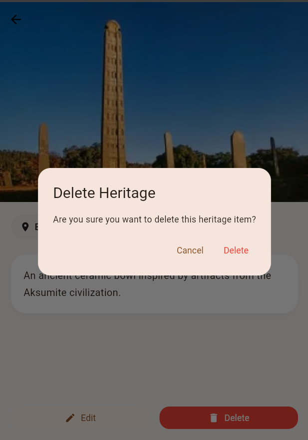

# Assignment Cultural Heritage Archive App

# Cultural Heritage Archive App

A Flutter CRUD application that allows users to explore, add, edit, and delete cultural heritage items using a REST API.

## Features

- View list of cultural heritage items
- View detailed information about a heritage item
- Add new heritage items
- Edit existing heritage items
- Delete heritage items
- Loading indicators and error handling
- Provider state management
- HTTP API integration
- Material Design UI

## Tech Stack

- Flutter
- Dart
- Provider
- HTTP Package
- MockAPI

## Project Structure

lib/
├── core/
│   ├── constants/
│   ├── routes/
│   ├── theme/
│   └── utils/
│
├── models/
│   └── heritage_item.dart
│
├── providers/
│   └── heritage_provider.dart
│
├── services/
│   └── heritage_api_service.dart
│
├── screens/
│   └── heritage/
│       ├── heritage_list_screen.dart
│       ├── heritage_detail_screen.dart
│       ├── add_heritage_screen.dart
│       └── edit_heritage_screen.dart
│
├── widgets/
│   └── heritage_card.dart
│
└── main.dart

## CRUD Operations

| Operation | Method | Description |
|----------|--------|-------------|
| Create | POST | Add new heritage item |
| Read | GET | Fetch all heritage items |
| Update | PUT/PATCH | Edit heritage item |
| Delete | DELETE | Remove heritage item |

## API Used

MockAPI REST API
Base URL:
https://6a03a0f82afe8349b4b56458.mockapi.io/heritage

## State Management

This project uses Provider for:

- State updates
- Loading states
- Error handling
- UI rebuilding

## Screens

### 1. Heritage List Screen
- Displays all heritage items
- Pull-to-refresh support
- Loading and error states
- Floating action button for adding items

### 2. Heritage Detail Screen
- Displays full heritage details
- Edit and delete functionality

### 3. Add Heritage Screen
- Form validation
- POST request integration

### 4. Edit Heritage Screen
- Pre-filled form
- Update existing items

### Author
#Ebise Tekle

###screenshots

-

